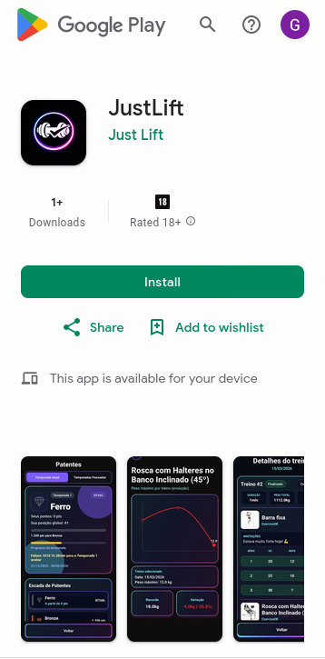

<div align="center">

# 🏋️ JustLift

**Diário de treino com social, gamificação e mídia.**

[](https://www.typescriptlang.org/)
[](https://developer.mozilla.org/en-US/docs/Web/JavaScript)
[](https://www.postgresql.org/)

</div>

---

## 📲 Disponível na Play Store

<div align="center">

[](https://play.google.com/store/apps/details?id=com.gabrielvicentm.app_treino&hl=en-US&ah=05sy7eCtDKMLv0CQsxSJA8UU0p0)



</div>

---

## 📖 Sobre

O **JustLift** é um app mobile de diário de treino que vai além do simples registro de exercícios. Ele combina:

- 📓 **Diário de treino completo** — registre séries, cargas e repetições
- 📊 **Gráficos e evolução** — visualize seu progresso ao longo do tempo
- 🏆 **Gamificação** — sistema de pontos, patentes e ranking por temporadas
- 📱 **Social** — feed de posts, dailies (stories), seguir usuários e interagir
- 🔔 **Notificações** — menções, curtidas, comentários e novos seguidores
- 💎 **Premium** — funcionalidades exclusivas via assinatura (RevenueCat)

---

## 🗂️ Estrutura do Projeto

```
JustLift/
├── frontend/          # App mobile (React Native / Expo)
│   └── app/
│       └── screens/
│           ├── auth/
│           ├── diario/
│           ├── social/
│           └── settings/
└── backend/           # API REST (Node.js + Express)
    └── src/
        ├── routes/
        ├── controller/
        ├── service/
        ├── middleware/
        ├── config/
        └── utils/
```

---

## 📱 Frontend — Telas e Features

### 🔐 Autenticação
| Tela | Descrição |
|------|-----------|
| `Login.tsx` | Login com email/username + senha ou Google |
| `Register.tsx` | Cadastro com verificação de email por código |

### 🏠 Home & Explorar
| Tela | Descrição |
|------|-----------|
| `Home.tsx` | Feed principal com posts e dailys (stories) |
| `Explorar.tsx` | Feed explorar em grid + barra de pesquisa |

### 📓 Diário de Treino
| Tela | Descrição |
|------|-----------|
| `Diario.tsx` | Entrada principal do diário de treino |
| `AdicionarExercicios.tsx` | Seleção de exercícios (banco + customizados) |
| `AdicionarSeries.tsx` | Adição de séries, cargas e repetições |
| `CriarExercicio.tsx` | Criação de exercício personalizado |
| `MeusTreinos.tsx` | Histórico e lista de treinos |
| `DetalheTreino.tsx` | Detalhe completo por dia/treino |
| `Retrospectiva.tsx` | Resumo semanal, mensal e anual |
| `Graficos.tsx` | Hub central de gráficos |
| `GraficoVolumeTreino.tsx` | Distribuição de volume por músculo |
| `GraficoExercicios.tsx` | Exercícios realizados com recordes |
| `GraficoExercicioDetalhe.tsx` | Evolução de carga de um exercício específico |
| `Ranking.tsx` | Ranking global e gamificação |
| `Patentes.tsx` | Patentes e progresso da temporada |
| `CriarPostTreino.tsx` | Criação de post social baseado em um treino |

### 👥 Social
| Tela | Descrição |
|------|-----------|
| `Perfil.tsx` | Perfil do usuário logado |
| `[username].tsx` | Perfil público de outro usuário |
| `FollowersFollowing.tsx` | Listas de seguidores e seguindo |
| `SearchUsers.tsx` | Busca de usuários e posts |
| `Conversas.tsx` | Lista de conversas |
| `Chat.tsx` | Conversa 1:1 |
| `CriarPost.tsx` | Criar post com texto e mídia |
| `EditarPost.tsx` | Editar post existente |
| `Post/[id].tsx` | Visualizar post e comentários |
| `CriarDaily.tsx` | Criar daily (story — batch de mídias) |
| `VerDaily.tsx` | Visualizar daily de um usuário |
| `UpdateProfile.tsx` | Editar dados do perfil |

### ⚙️ Configurações
| Tela | Descrição |
|------|-----------|
| `Configuracoes.tsx` | Tela de configurações geral |
| `Conta.tsx` | Gestão de conta (email, senha, username) |
| `Notificacoes.tsx` | Notificações e histórico |
| `GerenciarPosts.tsx` | Gestão de posts e dailys do usuário |
| `Premium.tsx` | Status e gestão de assinatura premium |

---

## 🔧 Backend — Arquitetura e Módulos

### Arquitetura Geral

```
HTTP → server.js → app.js → Middleware (Auth JWT) → Routes → Controller → Service → PostgreSQL
```

**Serviços externos integrados:**
- 📧 **Resend** — envio de emails transacionais
- 🔐 **Google OAuth2** — login/cadastro via Google
- 💳 **RevenueCat** — gestão de assinaturas premium
- 📲 **Expo Push** — notificações push
- ☁️ **Cloudflare R2** — upload de mídias (presigned URLs)

---

### 🔑 Auth — `/api/user`

| Método | Rota | Descrição |
|--------|------|-----------|
| POST | `/register` | Criar conta (envia código por email) |
| POST | `/register/verify` | Confirmar cadastro com código |
| POST | `/register/resend` | Reenviar código de verificação |
| POST | `/login` | Login com email/username + senha |
| GET | `/google/config` | Configurações do Google OAuth |
| POST | `/google/login` | Login via Google |
| POST | `/google/register` | Cadastro via Google |
| POST | `/refresh` | Renovar access token via refresh token |
| POST | `/logout` | Logout (invalida refresh token) |

### 👤 Perfil — `/api/profile`

| Método | Rota | Descrição |
|--------|------|-----------|
| GET | `/me` | Obter meu perfil |
| PUT | `/me` | Atualizar meu perfil |
| GET | `/u/:username` | Perfil público por username |
| POST | `/account-change/request` | Iniciar alteração de conta (envia código) |
| POST | `/account-change/confirm` | Confirmar código de alteração |
| POST | `/account-change/apply` | Aplicar alteração (email, senha, username) |
| DELETE | `/account` | Deletar conta |

### 🤝 Seguidores — `/api/follows`

| Método | Rota | Descrição |
|--------|------|-----------|
| GET | `/followers` | Lista de seguidores |
| GET | `/following` | Lista de quem o usuário segue |
| GET | `/requests` | Solicitações de follow pendentes |
| POST | `/following/:targetUserId` | Seguir usuário |
| POST | `/requests/:targetUserId` | Solicitar follow (perfil privado) |
| POST | `/requests/:requestId/accept` | Aceitar solicitação |
| DELETE | `/requests/:requestId` | Recusar solicitação |
| DELETE | `/following/:targetUserId` | Deixar de seguir |
| DELETE | `/followers/:followerUserId` | Remover seguidor |

### 🧭 Feed — `/api/feed`

| Método | Rota | Descrição |
|--------|------|-----------|
| GET | `/home` | Feed principal (60% seguidos, 40% discovery) |
| GET | `/explore` | Feed explorar (90% discovery) |
| GET | `/suggested-users` | Sugestões de usuários para seguir |

### 📝 Posts — `/api/posts`

| Método | Rota | Descrição |
|--------|------|-----------|
| POST | `/create-post` | Criar post (texto + mídias + menções) |
| GET | `/user/:userId` | Listar posts de um usuário |
| GET | `/:postId` | Buscar post com mídias e comentários |
| PUT | `/:postId` | Editar post |
| DELETE | `/:postId` | Apagar post |
| POST | `/:postId/like` | Curtir/descurtir post |
| POST | `/:postId/save` | Salvar/desfavoritar post |
| POST | `/:postId/report` | Reportar post |
| POST | `/:postId/comments` | Comentar post |
| DELETE | `/:postId/comments/:commentId` | Excluir comentário |
| POST | `/:postId/comments/:commentId/like` | Curtir comentário |

### 🏋️ Posts de Treino — `/api/treino-posts`

| Método | Rota | Descrição |
|--------|------|-----------|
| POST | `/` | Criar post de treino |
| GET | `/preview/:treinoId` | Prévia/resumo do treino para postar |

### 📸 Daily (Stories) — `/api/daily`

| Método | Rota | Descrição |
|--------|------|-----------|
| POST | `/` | Criar daily (batch de mídias, máx. 20, vídeos até 15s) |
| GET | `/user/:userId` | Daily ativo do usuário (últimas 24h) |
| GET | `/user/:userId/summary` | Resumo: total ativo e não vistos |
| POST | `/:dailyId/like` | Curtir/descurtir daily |
| POST | `/:dailyId/view` | Marcar daily como visto |
| DELETE | `/:dailyId` | Excluir daily |

### 🔍 Busca — `/api/search`

| Método | Rota | Descrição |
|--------|------|-----------|
| GET | `/users` | Buscar usuários |
| GET | `/posts` | Buscar posts |

### ☁️ Mídia — `/api/media`

| Método | Rota | Descrição |
|--------|------|-----------|
| POST | `/presign` | Gerar URL de upload (presigned) |
| POST | `/complete` | Confirmar upload |

### 💬 Conversas/Chat — `/api/conversas` e `/api/chat`

| Método | Rota | Descrição |
|--------|------|-----------|
| POST | `/chat/:targetUserId/messages` | Enviar mensagem |
| POST | `/conversas/:targetUserId/hide` | Ocultar conversa |
| POST | `/conversas/:targetUserId/pin` | Fixar conversa |
| POST | `/conversas/:targetUserId/block` | Bloquear conversa |

### 🔔 Notificações — `/api/notifications`

| Método | Rota | Descrição |
|--------|------|-----------|
| POST | `/push-token` | Registrar token de push |
| POST | `/test` | Teste de envio |

### 💎 Premium — `/api/premium`

| Método | Rota | Descrição |
|--------|------|-----------|
| POST | `/sync` | Sincronizar assinatura premium |

---
